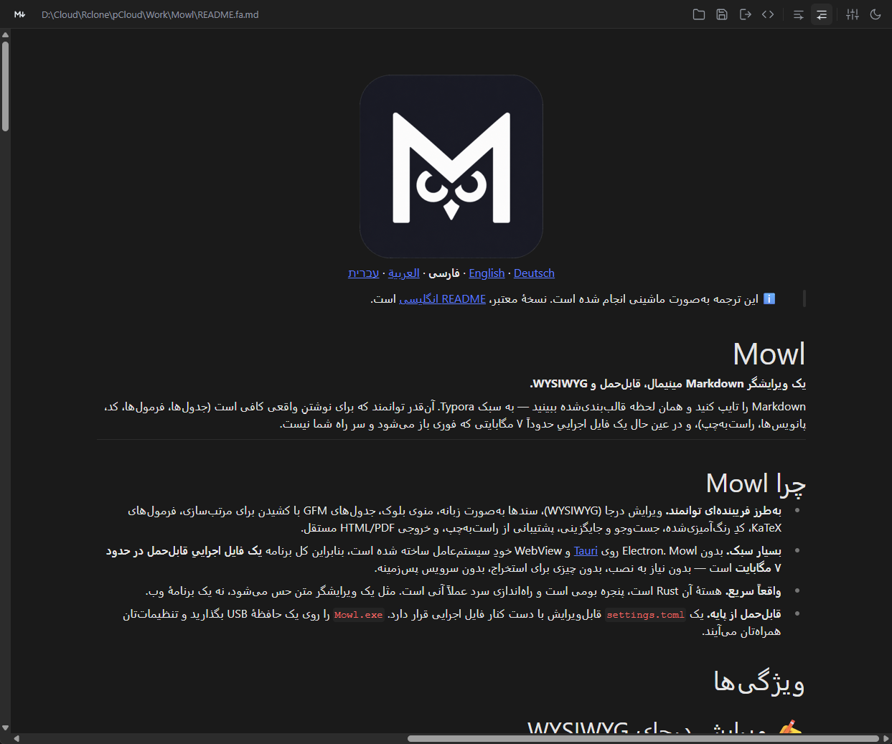

<div align="center">


**English** · [Deutsch](README.de.md) · [فارسی](README.fa.md) · [العربية](README.ar.md) · [עברית](README.he.md)

</div>

# Mowl

**A minimalist, portable WYSIWYG Markdown editor — with full right‑to‑left
(RTL) support.**

Type Markdown, see it formatted inline — Typora‑style. Powerful enough for real
writing (tables, math, code, footnotes, and right‑to‑left text for Persian,
Arabic and Hebrew), yet a single \~7 MB executable that starts instantly and
stays out of your way.

[Features](#features) · [Screenshots](#screenshots) · [Download](#download) · [Configuration](#configuration) · [Building](#building)

***

## Why Mowl

- **Deceptively powerful.** Inline WYSIWYG editing, tabbed documents, a block
  menu, GFM tables with drag‑to‑reorder, KaTeX math, syntax‑highlighted code,
  find & replace, right‑to‑left support, and self‑contained HTML / PDF export.
- **Extremely lean.** No Electron. Mowl is built on [Tauri](https://tauri.app)
  and your operating system's own WebView, so the whole app is a **single
  portable executable of roughly 7 MB** — no installer required, nothing to
  unpack, no background services.
- **Genuinely fast.** The core is Rust, the window is native, and cold start is
  effectively instant. It feels like a text editor, not a web app.
- **Portable by design.** One hand‑editable `settings.toml` lives next to the
  executable. Drop `Mowl.exe` on a USB stick and your preferences travel with it.

## Features

### ✍️ Inline WYSIWYG editing

Powered by [Milkdown Crepe](https://milkdown.dev) (ProseMirror). Headings, bold,
lists, quotes and the rest render as you type — but the document on disk is always
plain, portable Markdown.

### 🔗 Links without the syntax dance

Select some text, then **paste a URL with `Ctrl/Cmd+V`** — the selection becomes
the link text and the pasted URL becomes its target. No `[]()` typing, no dialog.
Prefer the keyboard? Select text and press **`Ctrl/Cmd+K`** to turn it into a link
using whatever URL is on the clipboard (or an empty link you can fill in).

### 🖼️ Images that just show up

`` renders inline in the editor, including **relative paths**
resolved against the document's own folder (`./assets/diagram.png`,
`../shared/logo.svg`) and absolute local paths — not just `http(s)` URLs. Add one
from the `⠿` block menu ("Image"), then paste a link or pick a file.

### ↔️ Right‑to‑left (RTL) Markdown editing

Mowl is a Markdown editor with genuine **RTL support**, not an LTR editor with a
CSS flip bolted on. One click toggles the whole document between **LTR and RTL**
for Persian, Arabic or Hebrew writing, quotes and lists included. The choice is
remembered per install. Code blocks are always kept left‑to‑right — even inside
an RTL document — and the direction is carried through to HTML export
(`<html dir="rtl">`).

### 🧱 Block menu

Hover any block and click the `⠿` button for a quick menu that acts on that block:

- **Turn into** — Text, Heading 1–3, bullet list, numbered list, quote, code
  block, or **table**
- **Insert** a table, an image, a divider, or a blank line above / below
- **Duplicate** or **delete** the block

The current block's type is highlighted so you always know what you're editing.
The turn‑into types also have keyboard shortcuts — `Ctrl/Cmd+0`–`7` (Text, H1, H2,
H3, bullet list, numbered list, quote, code block) — applied to the selection just
like the menu.

### 😀 Emoji

Press `Ctrl/Cmd+.` for a searchable emoji picker, or just type a `:shortcode:`
(e.g. `:tada:` → 🎉, `:+1:` → 👍) and it turns into the emoji as you close the
colon. Native Unicode — no images, nothing downloaded.

### 📑 Tabs with session restore

Open several documents as tabs. Close Mowl, reopen it, and your tabs — and even
their scroll positions — come back. (Toggleable in the config.)

### 👁️ Source view

Toggle between the rich editor and the **raw Markdown** in a plain text area with
`Ctrl/Cmd+Shift+C`. `Tab` / `Shift+Tab` indent and outdent selected lines, and
native undo keeps working.

### 🔍 Find & replace

`Ctrl/Cmd+F` to find, `Ctrl/Cmd+H` to replace — works in both the WYSIWYG editor
and the source view.

### 📊 Tables that behave

Full GitHub‑Flavored Markdown tables. **Drag rows and columns** to reorder them,
add a table straight from the block menu, and hand‑typed tables are automatically
**aligned and padded** in the saved `.md` file so the raw Markdown stays readable.

### 🧮 Math & 💻 code

- **KaTeX** math, inline (`$…$`) and display (`$$…$$`)
- Syntax‑highlighted **code blocks** with language detection

Plus the rest of GFM: task lists, footnotes, strikethrough, autolinks.

### 📤 Export

- **Self‑contained HTML** — a single file with KaTeX and highlighting styles
  inlined, nothing to host
- **PDF** via the system print dialog

### 🎨 Themes & appearance

Light and dark themes that follow the OS by default, with a manual toggle. Editor
font, font size, source‑view font, and accent colour are all configurable.

### 🧩 Raw HTML, rendered

Markdown files from GitHub are full of small HTML snippets. Mowl shows the common
ones as what they are instead of as literal tags: `` (including local
paths, `width`/`align`, and images wrapped in `<div align="center">`, `<p>` or
`<a>`), `<kbd>`, links written as `<a href>`, collapsible `<details>` /
`<summary>` sections (click the summary to fold), `<div align="…">` blocks, and
`<!--more-->` markers. It is display only — your Markdown is saved exactly as
you wrote it, and everything else stays literal text.

Click an image and a small toolbar appears: align it left, centre or right,
scale it to 25 / 50 / 75 / 100 % of its original size, or remove it. An
untouched image stays plain Markdown (``); once you scale or align
it, it is saved as ``, which GitHub and most other
renderers understand — and set back to defaults it becomes plain Markdown again.

### 🗂️ File associations

Set Mowl as the default app for `.md` / `.markdown` files (via the installer).
Double‑click a Markdown file and it opens in a new tab of the running window.
You can also drag one or more `.md` / `.markdown` / `.mdx` / `.txt` files onto the
window to open them.

Using the portable `Mowl.exe` on Windows? The settings screen has a **System**
section with a *Register* button that adds Mowl to the "Open with" menu of
Markdown files — per user, no admin rights, and fully removable again. (Windows
never lets a program make itself the default; choose *Always* once in the "Open
with" dialog.) If you move the exe, Mowl repairs the registration on next start.

### ⚙️ Settings, GUI or file

Every setting can be changed from an in‑app screen — the settings button in the
toolbar (or `Ctrl/Cmd+,`) flips it open over the editor, with one control per
option and changes applied and saved as you make them. Or edit the single,
commented `settings.toml` next to the executable in any text editor — Mowl
**picks up the change within a second, no restart**. If the program folder is
read‑only, Mowl falls back to the OS config directory and tells you so in the
window. Every release also ships a fully commented `settings.example.toml`.

### 🔄 Updates

On Windows, Mowl can update itself. **About → Check for updates** looks at the
latest GitHub release; if there is a newer one you can download it, and Mowl
verifies its signature against a key built into the app before it installs
anything. The portable `Mowl.exe` is replaced in place and restarted (the previous
version stays next to it as `Mowl.exe.old` until the next start), installer builds
run the new installer, and Scoop installs are pointed at `scoop update mowl`. Once a
day at startup Mowl checks quietly and puts a dot on the About button if something
is new. This is the only time Mowl talks to the internet by itself — switch it off
with **Settings → System → Check for updates automatically** or
`auto_check_updates = false`. **Settings → System** also has a
*Check now* button.

### 🌍 English and Deutsch

The interface is available in **English and German**, following the OS language
by default (`language = "system" | "en" | "de"`, switchable in the settings
screen).

## Screenshots

| Light                                                 | Dark                                           |
| ----------------------------------------------------- | ---------------------------------------------- |
|  |  |

| Right‑to‑left (per file)                           |                          Block menu                           |
| -------------------------------------------------- | :-----------------------------------------------------------: |
|  |  |

## Keyboard shortcuts

| Action                       | Shortcut           |
| ---------------------------- | ------------------ |
| New tab                      | `Ctrl/Cmd+N`       |
| Open                         | `Ctrl/Cmd+O`       |
| Save                         | `Ctrl/Cmd+S`       |
| Save As                      | `Ctrl/Cmd+Shift+S` |
| Close tab                    | `Ctrl/Cmd+W`       |
| Export (HTML / PDF)          | `Ctrl/Cmd+E`       |
| Toggle source view           | `Ctrl/Cmd+Shift+C` |
| Find                         | `Ctrl/Cmd+F`       |
| Replace                      | `Ctrl/Cmd+H`       |
| Link from clipboard          | `Ctrl/Cmd+K`       |
| Paste URL onto selected text | `Ctrl/Cmd+V`       |
| Block: Text / H1–H3 / lists / quote / code | `Ctrl/Cmd+0`–`7` |
| Insert emoji                 | `Ctrl/Cmd+.`       |
| Settings                     | `Ctrl/Cmd+,`       |

These are the defaults. The application shortcuts (everything except the
clipboard, link and block-type keys) can be changed in the settings screen —
click a field and press the new combination — or under `[shortcuts]` in
`settings.toml`.

## Download

Grab the latest build from the [Releases](../../releases) page.

- **Windows (x64)** — portable `Mowl.exe` (\~7 MB, no install), the NSIS
  installer, or via [Scoop](https://scoop.sh):

  ```powershell
  scoop bucket add naderi https://github.com/naderi/scoop-bucket
  scoop install naderi/mowl
  ```

- **macOS** — universal `.dmg` (Intel + Apple Silicon)
- **Linux** — `.AppImage`, `.deb`, or `.rpm` (x64 + arm64)

Builds are **not** code‑signed or notarized, so the OS may warn on first launch:

- **Windows** — SmartScreen: *More info → Run anyway*
- **macOS** — right‑click the app → *Open*, or
  `xattr -dr com.apple.quarantine /path/to/Mowl.app`
- **Linux** — `chmod +x Mowl*.AppImage` and run

SHA‑256 checksums are published with every release.

## Configuration

`settings.toml` sits next to the executable (on macOS: next to the `.app`), or in
the OS config directory as a fallback. The top section is meant for hand editing
and is reloaded live:

```toml
language = "system"         # system (follow the OS) | en | de
theme = "system"            # system | light | dark
direction = "ltr"           # ltr | rtl
spellcheck = true
quit_on_escape = false      # press Esc to quit
list_marker = "*"           # bullet-list marker on save: * | - | +
show_path = false           # show the full file path in the header, not just the name
open_last_session = true    # reopen the previous session's tabs on startup
always_show_tabbar = false  # keep the tab bar visible even with only one file open
editor_font = ""            # WYSIWYG font family (blank = default)
editor_font_size = 16       # headings scale from this
source_font = ""            # Markdown source font (monospace)
source_font_size = 15
accent = ""                 # accent colour, e.g. "#0969da"

# below this line: managed by the app — window geometry, open tabs
```

## Building

Prerequisites:

- Rust (stable; MSVC toolchain on Windows) — <https://rustup.rs>
- Node 20+ and `pnpm`
- Platform WebView dependencies — see <https://tauri.app/start/prerequisites/>

```bash
pnpm install
pnpm tauri dev                       # run with hot reload
pnpm tauri build                     # release bundles for the host OS
pnpm tauri build --bundles nsis      # Windows: installer + portable exe
pnpm exec tsc --noEmit               # frontend typecheck
cargo test --manifest-path src-tauri/Cargo.toml   # Rust unit tests
```

**Cutting a release:** bump `version` in `package.json`,
`src-tauri/tauri.conf.json` and `src-tauri/Cargo.toml`, push a `v*` tag, then
run [`.github/workflows/release.yml`](.github/workflows/release.yml) manually
(Actions tab or `gh workflow run release.yml --ref v1.7.0`) — it builds
Windows / macOS / Linux (x64 + arm64) and opens a draft GitHub release with
checksums.

Extending Mowl? Read **[ARCHITECTURE.md](ARCHITECTURE.md)** — it maps every file
and shows how to add toolbar buttons, block‑menu items, settings and commands.

## Tech stack

| Layer                  | Choice                                                  |
| ---------------------- | ------------------------------------------------------- |
| Shell                  | [Tauri v2](https://tauri.app) (Rust, system WebView)    |
| Editor                 | [`@milkdown/crepe`](https://milkdown.dev) (ProseMirror) |
| Markdown → HTML export | [`comrak`](https://github.com/kivikakk/comrak) (Rust)   |
| Math                   | [KaTeX](https://katex.org)                              |

## Support

If Mowl saves you time, you can support its development on Ko‑fi. ☕

<a href='https://ko-fi.com/N7N123QIX0' target='_blank'></a>
