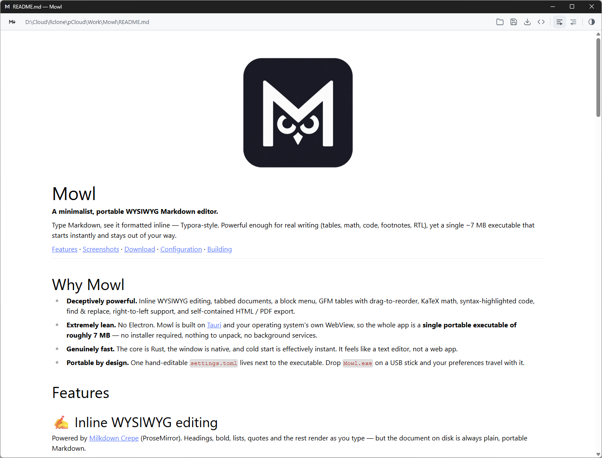
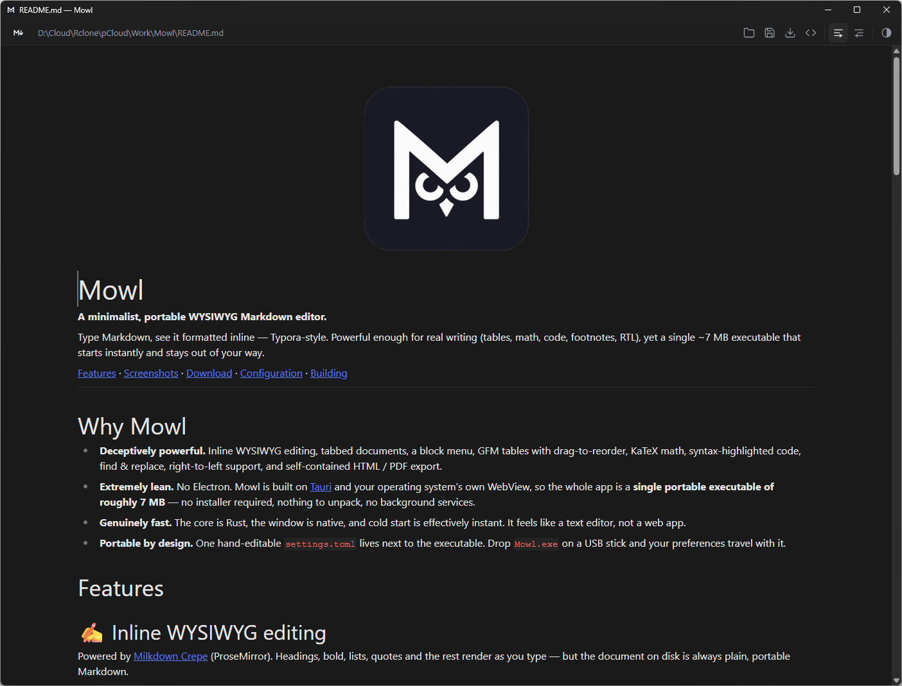
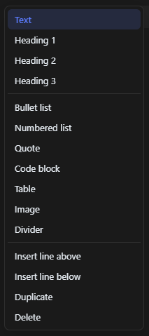

# Mowl

**A minimalist, portable WYSIWYG Markdown editor.**

Type Markdown, see it formatted inline — Typora‑style. Powerful enough for real
writing (tables, math, code, footnotes, RTL), yet a single ~7 MB executable that
starts instantly and stays out of your way.

[Features](#features) · [Screenshots](#screenshots) · [Download](#download) · [Configuration](#configuration) · [Building](#building)

---

## Why Mowl

- **Deceptively powerful.** Inline WYSIWYG editing, tabbed documents, a block
  menu, GFM tables with drag‑to‑reorder, KaTeX math, syntax‑highlighted code,
  find & replace, right‑to‑left support, and self‑contained HTML / PDF export.
- **Extremely lean.** No Electron. Mowl is built on [Tauri](https://tauri.app)
  and your operating system's own WebView, so the whole app is a **single
  portable executable of roughly 7 MB** — no installer required, nothing to
  unpack, no background services.
- **Genuinely fast.** The core is Rust, the window is native, and cold start is
  effectively instant. It feels like a text editor, not a web app.
- **Portable by design.** One hand‑editable `settings.toml` lives next to the
  executable. Drop `Mowl.exe` on a USB stick and your preferences travel with it.

## Features

### ✍️ Inline WYSIWYG editing

Powered by [Milkdown Crepe](https://milkdown.dev) (ProseMirror). Headings, bold,
lists, quotes and the rest render as you type — but the document on disk is always
plain, portable Markdown.

### 🔗 Links without the syntax dance

Select some text, then **paste a URL with `Ctrl/Cmd+V`** — the selection becomes
the link text and the pasted URL becomes its target. No `[]()` typing, no dialog.
Prefer the keyboard? Select text and press **`Ctrl/Cmd+K`** to turn it into a link
using whatever URL is on the clipboard (or an empty link you can fill in).

### 🖼️ Images that just show up

`` renders inline in the editor, including **relative paths**
resolved against the document's own folder (`./assets/diagram.png`,
`../shared/logo.svg`) and absolute local paths — not just `http(s)` URLs. Add one
from the `⠿` block menu ("Image"), then paste a link or pick a file.

### ↔️ Right‑to‑left support

One click toggles the whole document between **LTR and RTL** for Persian, Arabic
or Hebrew writing. The choice is remembered per install. Code blocks are always
kept left‑to‑right — even inside an RTL document — and the direction is carried
through to HTML export (`<html dir="rtl">`).

### 🧱 Block menu

Hover any block and click the `⠿` handle for a quick menu that acts on that block:

- **Turn into** — Text, Heading 1–3, bullet list, numbered list, quote, code
  block, or **table**
- **Insert** a table, an image, a divider, or a blank line above / below
- **Duplicate** or **delete** the block

The current block's type is highlighted so you always know what you're editing.

### 📑 Tabs with session restore

Open several documents as tabs. Close Mowl, reopen it, and your tabs — and even
their scroll positions — come back. (Toggleable in the config.)

### 👁️ Source view

Toggle between the rich editor and the **raw Markdown** in a plain text area with
`Ctrl/Cmd+Shift+C`. `Tab` / `Shift+Tab` indent and outdent selected lines, and
native undo keeps working.

### 🔍 Find & replace

`Ctrl/Cmd+F` to find, `Ctrl/Cmd+H` to replace — works in both the WYSIWYG editor
and the source view.

### 📊 Tables that behave

Full GitHub‑Flavored Markdown tables. **Drag rows and columns** to reorder them,
add a table straight from the block menu, and hand‑typed tables are automatically
**aligned and padded** in the saved `.md` file so the raw Markdown stays readable.

### 🧮 Math & 💻 code

- **KaTeX** math, inline (`$…$`) and display (`$$…$$`)
- Syntax‑highlighted **code blocks** with language detection

Plus the rest of GFM: task lists, footnotes, strikethrough, autolinks.

### 📤 Export

- **Self‑contained HTML** — a single file with KaTeX and highlighting styles
  inlined, nothing to host
- **PDF** via the system print dialog

### 🎨 Themes & appearance

Light and dark themes that follow the OS by default, with a manual toggle. Editor
font, font size, source‑view font, and accent colour are all configurable.

### 🗂️ File associations

Set Mowl as the default app for `.md` / `.markdown` files (via the installer).
Double‑click a Markdown file and it opens in a new tab of the running window.

### 💾 Portable configuration

A single, commented `settings.toml` next to the executable. Edit it in any text
editor and Mowl **picks up the change within a second — no restart**. If the
program folder is read‑only, Mowl falls back to the OS config directory and tells
you so in the window. Every release also ships a fully commented
`settings.example.toml` as a reference.

## Screenshots

| Light | Dark |
|---|---|
|  |  |

<p align="center"></p>

## Keyboard shortcuts

| Action | Shortcut |
|---|---|
| New tab | `Ctrl/Cmd+N` |
| Open | `Ctrl/Cmd+O` |
| Save | `Ctrl/Cmd+S` |
| Save As | `Ctrl/Cmd+Shift+S` |
| Close tab | `Ctrl/Cmd+W` |
| Export (HTML / PDF) | `Ctrl/Cmd+E` |
| Toggle source view | `Ctrl/Cmd+Shift+C` |
| Find | `Ctrl/Cmd+F` |
| Replace | `Ctrl/Cmd+H` |
| Link from clipboard | `Ctrl/Cmd+K` |
| Paste URL onto selected text | `Ctrl/Cmd+V` |

## Download

Grab the latest build from the [Releases](../../releases) page.

- **Windows (x64)** — available now: portable `Mowl.exe` (~7 MB, no install) or
  the NSIS installer
- **macOS** (x64 + arm64) and **Linux** (x64 + arm64 AppImage) — *coming soon.*
  The cross‑platform release pipeline is in place
  ([`.github/workflows/release.yml`](.github/workflows/release.yml)); these builds
  will land in a future tagged release. Until then, build from source on the
  target OS (see [Building](#building)) — Mowl is a Tauri app and runs on all
  three.

Builds are **not** code‑signed or notarized, so the OS may warn on first launch:

- **Windows** — SmartScreen: *More info → Run anyway*
- **macOS** — right‑click the app → *Open*, or
  `xattr -dr com.apple.quarantine /path/to/Mowl.app`
- **Linux** — `chmod +x Mowl*.AppImage` and run

SHA‑256 checksums are published with every release.

## Configuration

`settings.toml` sits next to the executable (on macOS: next to the `.app`), or in
the OS config directory as a fallback. The top section is meant for hand editing
and is reloaded live:

```toml
theme = "system"            # system | light | dark
direction = "ltr"           # ltr | rtl
spellcheck = true
quit_on_escape = false      # press Esc to quit
list_marker = "*"           # bullet-list marker on save: * | - | +
show_path = false           # show the full file path in the header, not just the name
open_last_session = true    # reopen the previous session's tabs on startup
editor_font = ""            # WYSIWYG font family (blank = default)
editor_font_size = 16       # headings scale from this
source_font = ""            # Markdown source font (monospace)
source_font_size = 15
accent = ""                 # accent colour, e.g. "#0969da"

# below this line: managed by the app — window geometry, open tabs
```

## Building

Prerequisites:

- Rust (stable; MSVC toolchain on Windows) — <https://rustup.rs>
- Node 20+ and `pnpm`
- Platform WebView dependencies — see <https://tauri.app/start/prerequisites/>

```bash
pnpm install
pnpm tauri dev                       # run with hot reload
pnpm tauri build                     # release bundles for the host OS
pnpm tauri build --bundles nsis      # Windows: installer + portable exe
pnpm exec tsc --noEmit               # frontend typecheck
cargo test --manifest-path src-tauri/Cargo.toml   # Rust unit tests
```

**Cutting a release:** bump `version` in **both** `package.json` and
`src-tauri/tauri.conf.json`, then push a `v*` tag —
`.github/workflows/release.yml` builds Windows / macOS / Linux (x64 + arm64) and
opens a draft GitHub release with checksums.

Extending Mowl? Read **[ARCHITECTURE.md](ARCHITECTURE.md)** — it maps every file
and shows how to add toolbar buttons, block‑menu items, settings and commands.

## Tech stack

| Layer | Choice |
|---|---|
| Shell | [Tauri v2](https://tauri.app) (Rust, system WebView) |
| Editor | [`@milkdown/crepe`](https://milkdown.dev) (ProseMirror) |
| Markdown → HTML export | [`comrak`](https://github.com/kivikakk/comrak) (Rust) |
| Math | [KaTeX](https://katex.org) |

## Licence

MIT
